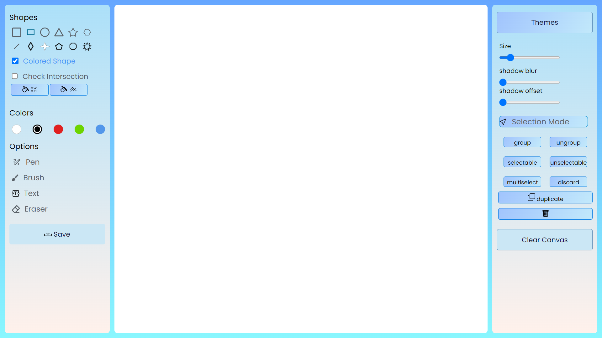

# Drawing Application

A JavaScript-based drawing application using the Model-View-Controller (MVC) pattern.

## Table of Contents

- [Description](#description)
- [Features](#features)
- [Getting Started](#getting-started)
- [Usage](#usage)
- [Demo](#demo)
- [Contributing](#contributing)
- [License](#license)

## Description

This drawing application allows users to create and manipulate various shapes on a canvas. It's built using Fabric.js JavaScript Framework and follows the MVC pattern for a modular and organized code structure.

## Features

- Draw rectangles, circles, triangles, text, and stars.
- Customize stroke and fill colors.
- Adjust brush size and shadow settings.
- Group and ungroup objects.
- Copy, paste,remove and duplicate objects.
- remove objects.
- Save drawings as images.
- Intersection checkbox to highlight overlapping objects.
- Touchscreen and Keyboard key support.
  - Move with [Arrow key].
  - Copy, paste and cut objects with [CTR+ key].
  - remove objects with [Backspace key].

## Getting Started

### Prerequisites

- Ensure you have a modern web browser installed.

### Installation

1. Clone the repository:

    ```bash
    git clone https://github.com/Hunde-D/Paint-App-Javascript.git
    ```

2. Open the `index.html` file in your preferred web browser:
    ```bash
    cd Paint-App-Javascript
    ```
    ```bash
    open index.html
    ```

## Usage

1. Choose a drawing tool from the toolbar.
2. Customize settings such as color, size, and shadow.
3. Click on the canvas to create or interact with objects.
4. Use the provided buttons for additional actions (grouping, ungrouping, copying, etc.).
5. Save your drawing as an image.

## Demo

[](https://hunde-d.github.io/Paint-App-Javascript)

Check out the [live demo](https://hunde-d.github.io/Paint-App-Javascript) for a hands-on experience.

## Contributing

Contributions are welcome!  Please follow the [contributing guidelines](CONTRIBUTING.md).

[//]: # (## License)

[//]: # ()
[//]: # (This project is licensed under the [MIT License]&#40;LICENSE&#41;.)
[//]: # ()
[//]: # ()
[//]: # ([![Author]&#40;https://img.shields.io/badge/Author-Prashant%20Pandey-blue.svg&#41;]&#40;https://prashantpandey.com&#41;)

[//]: # (## Contributors)

[//]: # ([![Contributors]&#40;https://img.shields.io/badge/Contributors-1-blue.svg&#41;]&#40;)
